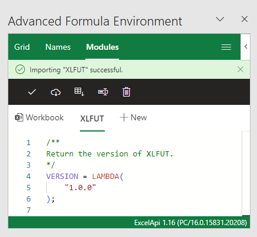
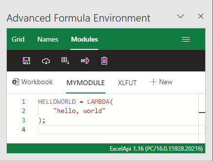
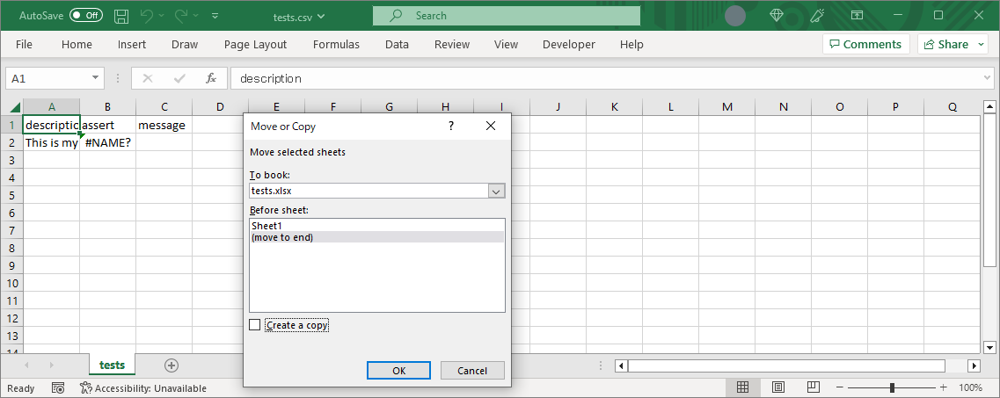
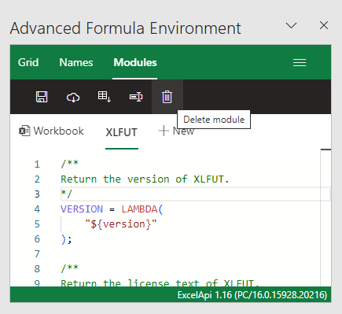
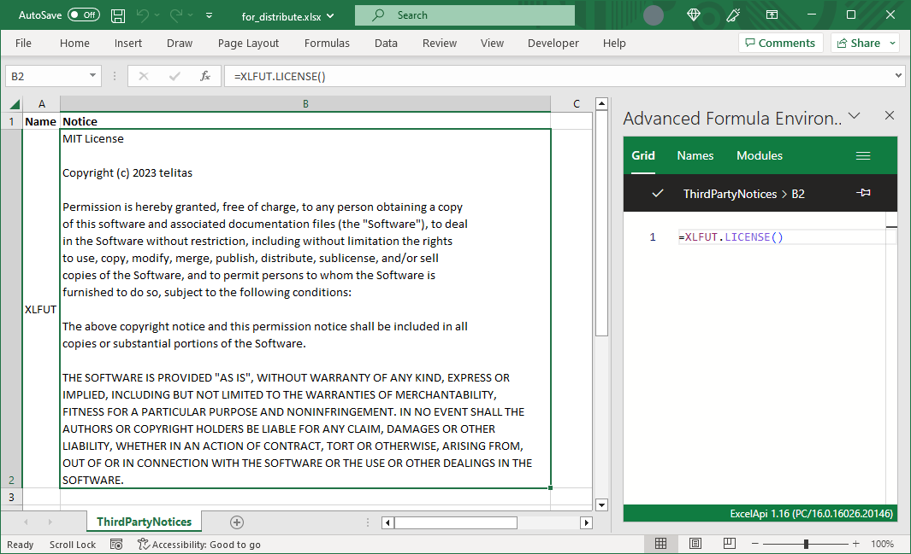

# XLFUT

## About XLFUT

XLFUT(eXceL Function/Formula Unit Test) is an unit testing framework for Excel.(not for VBA or OfficeScript)

## Language

- English
- [Japanese(日本語)](./doc/ja/README.md)

## Concept of XLFUT

### Macro-free

XLFUT is implemented without VBA or OfficeScript. So you may be able to use this under administrators controlled.

### Exportable as text

Unit tests written in XLFUT can be exported as CSV file.
It means unit tests can be easily managed by version management systems.

### Everything is done over plain Excel

Core features of XLFUT have no its own UI and can be used by only plain Excel UI.
Therefore if you can use Excel, you can also use XLFUT too.

## Get XLFUT

Get from [release page](https://github.com/telitas/XLFUT/releases) or [gist](https://gist.github.com/telitas/357f48349bf264bedb6eb5ec3661fe34).

## Introduction

### Install into a Excel workbook

As mentioned above, XLFUT works on plain Excel. However, if allowed, it is mote better using [Advanced formula environment(AFE)](https://www.microsoft.com/garage/profiles/advanced-formula-environment-a-microsoft-garage-project/), an Microsoft official add-in.

First, open AFE add-in via "Formula" tab > "Advanced formula Environment".


Next, Select "Modules" tab and push "Import from URL" button.


Next, Input `https://gist.github.com/telitas/357f48349bf264bedb6eb5ec3661fe34` into GitHub Gist URL. Check "Add formulas to new module?" and Input module name `XLFUT`.


Finally, XLFUT was imported.



### Write your first test

XLFUT tests are written in table format. The table has 3 columns:

1. description  
    Write the description for test. This column is recommended to be unique.
2. assert  
    Write the body of test code.
3. message  
    This column must be empty. It is reserved for an error message.


Now, we assumes we define  `MYMODULE.HELLOWORLD` function that takes no arguments and returns text "hello, world".

```excel
HELLOWORLD = LAMBDA(
    "hello, world"
);
```



Next, input the following values for each column in the first row and push the enter key.

1. description

```txt
This is my first test.
```

2. assert

```excel
=XLFUT.ASSERT_EQUAL(
    MYMODULE.HELLOWORLD(),
    "hello, world"
)
```

3. message  
    Keep empty.


Congratulation! Your first test passed.


### Export and import your tests

If you want to export tests as a text file, you can use `XLFUT.UTILS_EXPORTTESTS` function.

First, add new sheet and call `XLFUT.UTILS_EXPORTTESTS` function in A1 cell.
The argument is the range that covers all tests.


Next, save the sheet as CSV file.


When you want to import the exported test, open the csv file in excel and copy/move the sheet.



## Cautions on distributing your Excel workbook

XLFUT is released under the MIT License, one of the **Open Source License**. So you have some duties when you distribute other users your Excel workbook contains code of XLFUT.

In almost case, test codes is unnecessary for users. So it is recommended to remove the test codes and the XLFUT module from the Excel workbook for distribution.



If you really want to distribute your Excel workbook with XLFUT code, you are required to make the copyright and the permission notice under the MIT License. XLFUT has `XLFUT.LICENSE` function for notice license term. As an example of the notification, you add your workbook `ThirdPartyNotices` sheet and write the module name `XLFUT` and call `XLFUT.LICENSE` function.



## More informations

- [Reference](./doc/reference.md)
- [TIPS](./doc/TIPS.md)

## LICENSE

Copyright (c) 2023 telitas

This module is released under the MIT License.

See the LICENSE.txt file or <https://opensource.org/licenses/mit-license.php> for details.
