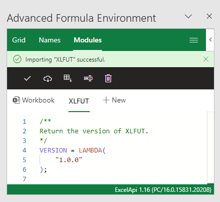
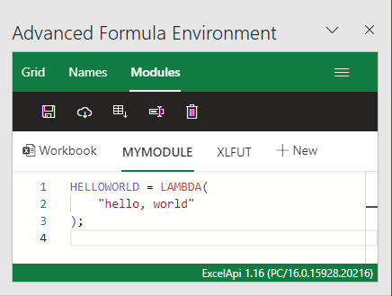
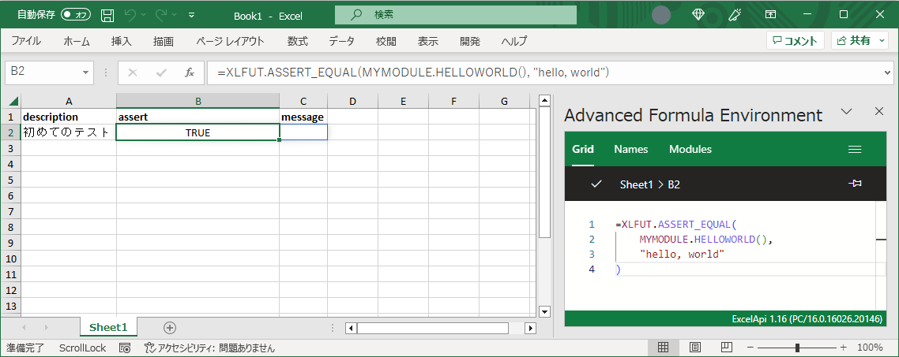
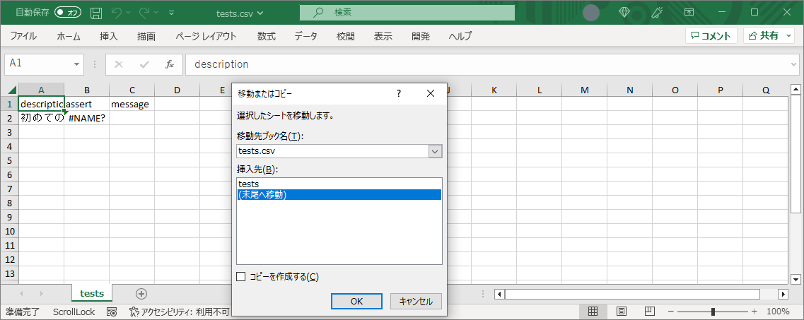
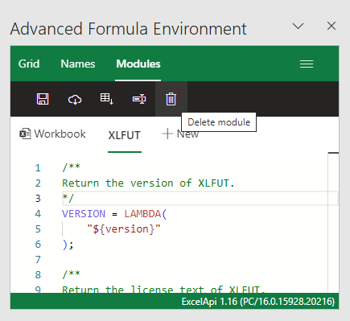
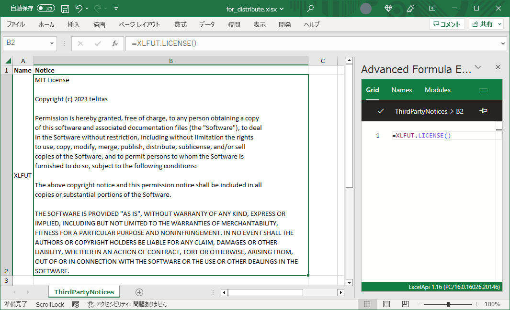

# XLFUT

## XLFUTとは

XLFUT(eXceL Function/Formula Unit Test)は、Excel数式用のユニットテスト/単体テストフレームワークです。（VBAやOfficeScript用ではありません）

## 言語

- [英語(English)](../../README.md)
- 日本語

## XLFUTのコンセプト

### マクロフリー

XLFUTはVBAやOfficeScriptを使用せずに実装されています。よって、あなたは管理者の制御下にあったとしても使えるかもしれません。

### テキスト出力可能

XLFUTで記述されたテストはCSVとして出力可能です。
これは、バージョン管理ツールで容易に管理できることを意味します。

### 純粋なExcel上で全てが完結

XLFUTの核となる機能は独自のUIを持たず、純粋なExcel UI上で機能します。
したがって、あなたがExcelを使えるのであれば、XLFUTもまた使いこなせます。

## XLFUTを入手

[リリースページ](https://github.com/telitas/XLFUT/releases) または[gist](https://gist.github.com/telitas/357f48349bf264bedb6eb5ec3661fe34)から入手してください。

## 導入

### Excelブックへのインストール

前項で示した通り、XLFUTは純粋なExcel上で機能します。しかし、もし可能であれば,Microsoft公式のアドインである[Advanced formula environment(AFE)](https://www.microsoft.com/garage/profiles/advanced-formula-environment-a-microsoft-garage-project/)を使用することが推奨されます。

最初に、"数式"タブ > "Advanced formula Environment"を開き、AFEアドインを開きます。


続いて、"Modules"タブを選択し、"Import from URL" ボタンを押します。


続いて、GitHub Gist URL欄に`https://gist.github.com/telitas/357f48349bf264bedb6eb5ec3661fe34`を入力します。"Add formulas to new module?"にチェックを入れ、module nameに`XLFUT`を入力します。


最後に、XLFUTがインポートされます。



### 初めてのテストを書く

XLFUTテストはテーブル形式で記述されます。テーブルは3つの列を持っています。

1. description  
    テストの詳細を記述します。この列の値は重複がないことが推奨されます。
2. assert  
    テストコードの本文を記述します。
3. message  
    この列は空のままにしておきます。ここはエラーメッセージのために予約されています。


ここでは、引数を持たず、"hello, world"というテキストを返す自作関数`MYMODULE.HELLOWORLD`を定義したと仮定します。

```excel
HELLOWORLD = LAMBDA(
    "hello, world"
);
```



続いて、以下に示す値を1行目のそれぞれの列に入力し、エンターを押します。

1. description

```txt
初めてのテスト
```

2. assert

```excel
=XLFUT.ASSERT_EQUAL(
    MYMODULE.HELLOWORLD(),
    "hello, world"
)
```

3. message  
    空欄のままにします


おめでとうございます。初めてのテストをパスしました。



### テストのエクスポートとインポート

もしテストをテキストファイルにエクスポートしたい場合、`XLFUT.UTILS_EXPORTTESTS`関数を使用します。

まず、新しいシートを追加してA1セルで`XLFUT.UTILS_EXPORTTESTS`関数を呼び出します。
引数には、全てのテストをカバーする範囲を指定します。


続いて、シートをcsvファイルとして保存します。


もしエクスポートしたテストをインポートしたい場合、csvファイルをExcelで開き、シートをコピーまたは移動します。



## Excelブック配布時の注意

XLFUTは**オープンソースライセンス**の一つである、MITライセンスのもと配布されています。したがって、XLFUTのコードが含まれるExcelブックを他のユーザーに配布する際、あなたはいくつかの義務を負います。

ほとんどの場合において、テストコードはユーザーにとって不要なものです。よって、配布用のExcelブックからテストコードとXLFUTモジュールを削除してしまうことを推奨します。



もし本当にXLFUTのコードを含んだExcelブックを配布する必要がある場合には、MITライセンスに基づき著作権表示及び許諾表示を行う必要があります。XLFUTにはライセンス文表示用の`XLFUT.LICENSE`関数が用意されています。表示の一例として、ブックに`ThirdPartyNotices`シートを追加し、モジュール名であるXLFUTと`XLFUT.LICENSE`ライセンス関数を呼び出します。



## 詳細

- [リファレンス](./reference.md)
- [TIPS](./TIPS.md)

## ライセンス

Copyright (c) 2023 telitas

This module is released under the MIT License.

See the LICENSE.txt file or <https://opensource.org/licenses/mit-license.php> for details.
